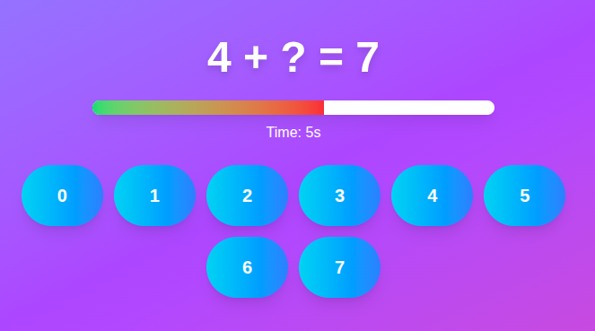

# Calculation Training Game

A fun and engaging web game designed to train number bonds.

## Introduction

Number bonds are crucial for learning addition and subtraction, acting as a foundational tool for early math proficiency. By identifying which pairs of numbers make a larger number (e.g., 3 and 7 make 10), children develop number sense, improve mental math speed, and understand the inverse relationship between adding and subtracting.

## Gameplay



### How to Play

1. **Select a Target Number**: Choose a target number between 2 and 20 to set the difficulty
1. **Solve the Equation**: Each round displays an equation like `4 + ? = 7`
1. **Beat the Timer**: You have 10 seconds per round to answer correctly
1. **Complete All Rounds**: Solve equations for all numbers from 0 to your target to win

## Getting Started

### Prerequisites

- Install [pnpm](https://pnpm.io/)

### Installation

Install dependencies

```bash
pnpm install
```

### Running the Game

```bash
pnpm dev
```

Open [http://localhost:3000](http://localhost:3000) in your browser

## License

See [LICENSE](./LICENSE) for details.
